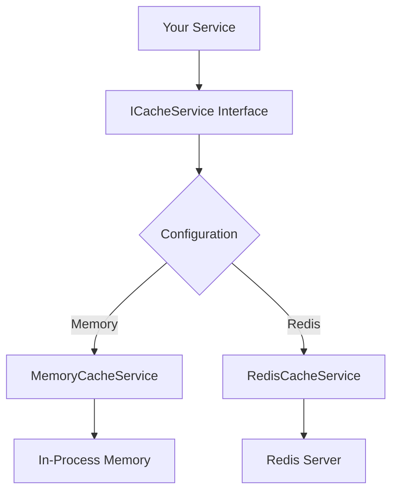

# Cache Provider Architecture

This document explains the cache provider system in the TalentManagement application, designed as a tutorial for new developers.

## What is Caching?

Caching is a technique to store frequently accessed data in memory for faster retrieval. Instead of repeatedly querying a database or calling an external API, we store the result temporarily and serve it from cache.

**Benefits:**
- ⚡ Faster response times
- 🔄 Reduced load on databases/APIs
- 💰 Lower infrastructure costs
- 📈 Better user experience

## Architecture Overview

Our cache system uses a **pluggable provider pattern** that allows switching between different caching implementations without changing application code.



## Core Interface

All caching operations go through the `ICacheService` interface:

```csharp
public interface ICacheService
{
    // Retrieve cached data
    Task<T?> GetAsync<T>(string key, CancellationToken cancellationToken = default) where T : class;
    
    // Store data with optional expiration
    Task SetAsync<T>(string key, T value, TimeSpan? expiration = null, CancellationToken cancellationToken = default) where T : class;
    
    // Remove single cache entry
    Task RemoveAsync(string key, CancellationToken cancellationToken = default);
    
    // Remove multiple entries by pattern
    Task RemovePatternAsync(string pattern, CancellationToken cancellationToken = default);
    
    // Check if key exists
    Task<bool> ExistsAsync(string key, CancellationToken cancellationToken = default);
    
    // Cache-aside pattern (get from cache or fetch and cache)
    Task<T> GetOrSetAsync<T>(string key, Func<Task<T>> getItem, TimeSpan? expiration = null, CancellationToken cancellationToken = default) where T : class;
}
```

## Cache Providers

### 1. Memory Cache Provider

**Best for:** Single-instance applications, development, small datasets

**Characteristics:**
- ✅ Fast access (in-process)
- ✅ No external dependencies
- ❌ Lost on application restart
- ❌ Not shared between app instances

```csharp
public class MemoryCacheService : ICacheService
{
    private readonly IMemoryCache _memoryCache;
    private readonly ConcurrentDictionary<string, object> _keyTracker = new();
    
    // Implementation handles JSON serialization internally
    // Uses key tracking for pattern-based removal
}
```

### 2. Redis Cache Provider

**Best for:** Multi-instance applications, production environments, shared data

**Characteristics:**
- ✅ Distributed across app instances
- ✅ Persists across app restarts
- ✅ Scalable and fast
- ❌ Requires Redis server
- ❌ Network latency

```csharp
public class RedisCacheService : ICacheService
{
    private readonly IDistributedCache _distributedCache;
    private readonly IDatabase _database; // For pattern operations
    
    // Uses StackExchange.Redis for advanced operations
    // Leverages Redis server for pattern matching
}
```

## Configuration

Configure the cache provider in `appsettings.json`:

### Memory Cache (Default)
```json
{
  "Cache": {
    "Provider": "Memory",
    "DefaultExpiration": "00:30:00",
    "SlidingExpiration": "00:05:00"
  }
}
```

### Redis Cache
```json
{
  "Cache": {
    "Provider": "Redis",
    "ConnectionString": "localhost:6379",
    "DefaultExpiration": "00:30:00",
    "SlidingExpiration": "00:05:00"
  }
}
```

## Usage Examples

### Basic Cache Operations

```csharp
public class EmployeeService
{
    private readonly ICacheService _cacheService;
    private readonly IEmployeeRepository _repository;

    public EmployeeService(ICacheService cacheService, IEmployeeRepository repository)
    {
        _cacheService = cacheService;
        _repository = repository;
    }

    // Example 1: Manual cache management
    public async Task<Employee?> GetEmployeeAsync(int id)
    {
        string cacheKey = $"employee:{id}";
        
        // Try to get from cache first
        var cachedEmployee = await _cacheService.GetAsync<Employee>(cacheKey);
        if (cachedEmployee != null)
        {
            return cachedEmployee;
        }

        // Cache miss - fetch from database
        var employee = await _repository.GetByIdAsync(id);
        if (employee != null)
        {
            // Cache for 1 hour
            await _cacheService.SetAsync(cacheKey, employee, TimeSpan.FromHours(1));
        }

        return employee;
    }

    // Example 2: Cache-aside pattern (recommended)
    public async Task<Employee?> GetEmployeeSimplifiedAsync(int id)
    {
        string cacheKey = $"employee:{id}";
        
        return await _cacheService.GetOrSetAsync(
            cacheKey,
            async () => await _repository.GetByIdAsync(id),
            TimeSpan.FromHours(1)
        );
    }

    // Example 3: Cache invalidation
    public async Task UpdateEmployeeAsync(Employee employee)
    {
        await _repository.UpdateAsync(employee);
        
        // Remove from cache so next request gets fresh data
        string cacheKey = $"employee:{employee.Id}";
        await _cacheService.RemoveAsync(cacheKey);
    }

    // Example 4: Pattern-based removal
    public async Task ClearDepartmentCacheAsync(int departmentId)
    {
        // Remove all employees from this department
        string pattern = $"employee:dept:{departmentId}:*";
        await _cacheService.RemovePatternAsync(pattern);
    }
}
```

### Advanced Usage with External APIs

```csharp
public class CachedUSAJobsService : IUSAJobsService
{
    private readonly USAJobsService _usaJobsService;
    private readonly ICacheService _cacheService;

    public async Task<SearchResponse> SearchJobsAsync(SearchRequest request)
    {
        // Create cache key from request parameters
        string cacheKey = $"usajobs:search:{request.GetHashCode()}";

        return await _cacheService.GetOrSetAsync(
            cacheKey,
            async () => await _usaJobsService.SearchJobsAsync(request),
            TimeSpan.FromMinutes(15) // Cache API results for 15 minutes
        );
    }
}
```

## Cache Key Strategies

### Good Cache Key Patterns
```csharp
// Entity by ID
$"employee:{employeeId}"
$"department:{deptId}"

// Query results
$"employees:dept:{deptId}:active:{isActive}"
$"search:jobs:{query.ToLower().Replace(' ', '-')}"

// User-specific data
$"user:{userId}:preferences"
$"user:{userId}:notifications:unread"

// Hierarchical patterns for bulk removal
$"employee:dept:{deptId}:{employeeId}"
$"cache:v1:employees:{filter}"
```

### Cache Key Best Practices
- Use consistent naming conventions
- Include version numbers for schema changes
- Make keys hierarchical for pattern removal
- Avoid special characters that might cause issues
- Keep keys reasonably short but descriptive

## Expiration Strategies

### Absolute Expiration
Data expires at a specific time regardless of usage:
```csharp
await _cacheService.SetAsync(key, data, TimeSpan.FromHours(1));
```

### Sliding Expiration
Data expiration resets when accessed (configured globally):
```json
{
  "Cache": {
    "SlidingExpiration": "00:05:00" // Extends by 5 minutes on access
  }
}
```

### Use Cases by Expiration Type
- **Short (1-5 minutes)**: Real-time data, user sessions
- **Medium (15-60 minutes)**: Search results, computed data
- **Long (1-24 hours)**: Reference data, rarely changing content
- **Very Long (days)**: Static configuration, lookup tables

## Error Handling and Resilience

The cache system is designed to be **fault-tolerant**:

```csharp
public async Task<T?> GetAsync<T>(string key, CancellationToken cancellationToken = default) where T : class
{
    try
    {
        // Cache operation
        var cachedValue = await _distributedCache.GetStringAsync(key, cancellationToken);
        return cachedValue == null ? null : JsonSerializer.Deserialize<T>(cachedValue, options);
    }
    catch (Exception ex)
    {
        _logger.LogError(ex, "Error retrieving cached value for key: {Key}", key);
        return null; // Graceful degradation - return null on cache failure
    }
}
```

**Key Principles:**
- Cache failures never break the application
- Always have a fallback to the original data source
- Log errors for monitoring but don't throw exceptions
- Use the cache to improve performance, not as primary storage

## Monitoring and Debugging

### Logging
The cache providers log important events:
- Cache hits/misses (Debug level)
- Cache errors (Error level)
- Cache evictions (Debug level)

### Useful Log Searches
```
Cache hit for key: employee:123
Cache miss for key: employee:456
Error retrieving cached value for key: search:jobs:developer
Removed 15 cached values matching pattern: employee:dept:5:*
```

### Performance Monitoring
Monitor these metrics:
- Cache hit ratio
- Average response time
- Cache memory usage (Memory provider)
- Redis connection health (Redis provider)

## Testing Cache Logic

### Unit Testing with Mock Cache
```csharp
[Test]
public async Task GetEmployee_Should_Return_Cached_Value_When_Present()
{
    // Arrange
    var mockCache = new Mock<ICacheService>();
    var employee = new Employee { Id = 1, Name = "John Doe" };
    mockCache.Setup(x => x.GetAsync<Employee>("employee:1", default))
           .ReturnsAsync(employee);
    
    var service = new EmployeeService(mockCache.Object, Mock.Of<IEmployeeRepository>());
    
    // Act
    var result = await service.GetEmployeeAsync(1);
    
    // Assert
    Assert.Equal(employee, result);
}
```

### Integration Testing
```csharp
[Test]
public async Task Cache_Integration_Test()
{
    // Use in-memory cache for integration tests
    var services = new ServiceCollection();
    services.AddMemoryCache();
    services.AddSingleton<ICacheService, MemoryCacheService>();
    
    var serviceProvider = services.BuildServiceProvider();
    var cache = serviceProvider.GetService<ICacheService>();
    
    // Test cache operations
    await cache.SetAsync("test:key", new { Value = "test" });
    var result = await cache.GetAsync<dynamic>("test:key");
    
    Assert.NotNull(result);
}
```

## Common Pitfalls and Solutions

### 1. Cache Key Collisions
**Problem**: Different data types using same key format
```csharp
// BAD
await cache.SetAsync($"data:{id}", employee);
await cache.SetAsync($"data:{id}", department); // Overwrites employee!
```

**Solution**: Include type in key
```csharp
// GOOD
await cache.SetAsync($"employee:{id}", employee);
await cache.SetAsync($"department:{id}", department);
```

### 2. Stale Data
**Problem**: Cache not invalidated when data changes

**Solution**: Invalidate cache on updates
```csharp
public async Task UpdateEmployeeAsync(Employee employee)
{
    await _repository.UpdateAsync(employee);
    await _cacheService.RemoveAsync($"employee:{employee.Id}");
    
    // Also invalidate related caches
    await _cacheService.RemovePatternAsync($"department:{employee.DepartmentId}:employees:*");
}
```

### 3. Memory Leaks (Memory Provider)
**Problem**: Large objects cached for too long

**Solution**: Use appropriate expiration times and cache size limits

### 4. Serialization Issues
**Problem**: Objects with circular references or complex types

**Solution**: Use DTOs or configure JSON serializer options
```csharp
public class EmployeeCacheDto
{
    public int Id { get; set; }
    public string Name { get; set; }
    public string DepartmentName { get; set; } // Flatten relationships
}
```

## Best Practices Summary

1. **Always use the cache-aside pattern** with `GetOrSetAsync`
2. **Handle cache failures gracefully** - never let cache issues break functionality
3. **Use consistent key naming conventions** for easy management
4. **Set appropriate expiration times** based on data freshness needs
5. **Invalidate cache when data changes** to prevent stale data
6. **Monitor cache performance** and adjust strategies as needed
7. **Test cache logic thoroughly** including failure scenarios
8. **Use hierarchical keys** for efficient pattern-based removal
9. **Consider data size** when choosing between Memory and Redis
10. **Log cache operations** for debugging and monitoring

## Conclusion

The cache provider system gives you powerful, flexible caching capabilities while keeping your application code clean and provider-agnostic. Start with the Memory provider for development and consider Redis for production environments with multiple application instances.

Remember: caching is an optimization technique. Always ensure your application works correctly without cache before adding caching logic.