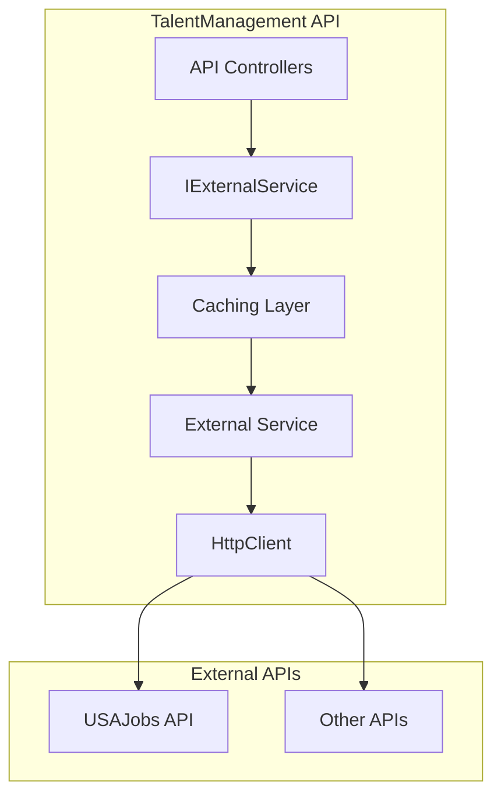
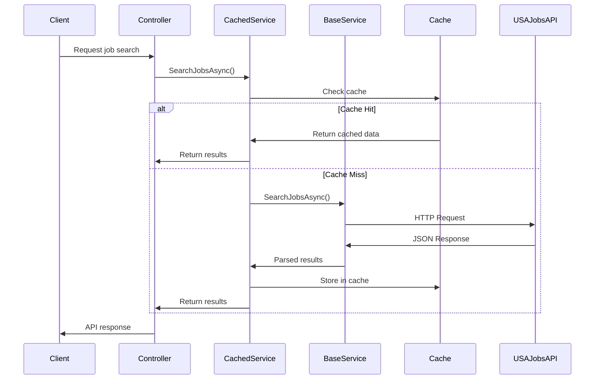
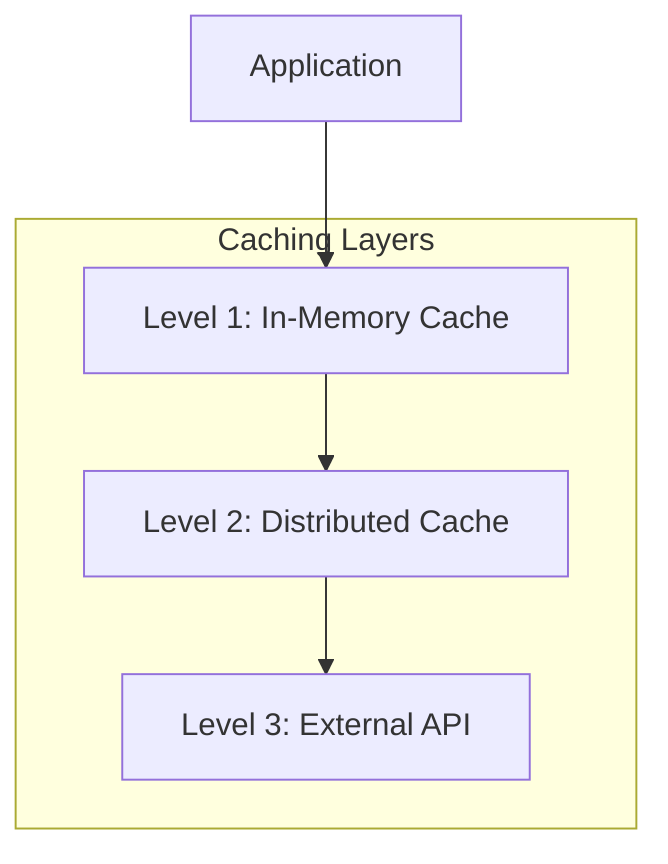

# External API Integration Architecture

This document provides comprehensive information about integrating external APIs in the TalentManagement system, with a focus on the USAJobs API implementation as a reference architecture pattern.

## 📋 Table of Contents

- [Overview](#overview)
- [Architecture Patterns](#architecture-patterns)
- [USAJobs API Integration](#usajobs-api-integration)
- [Service Layer Architecture](#service-layer-architecture)
- [Caching Strategy](#caching-strategy)
- [Error Handling & Resilience](#error-handling--resilience)
- [Configuration Management](#configuration-management)
- [Security Considerations](#security-considerations)
- [Testing Strategy](#testing-strategy)
- [Performance Optimization](#performance-optimization)
- [Monitoring & Observability](#monitoring--observability)
- [Implementation Guidelines](#implementation-guidelines)
- [Best Practices](#best-practices)

## 🎯 Overview

The TalentManagement system integrates with external APIs using a layered, resilient architecture that provides:

- **Abstraction Layer** - Clean interfaces separating external dependencies
- **Caching Layer** - Intelligent caching to reduce API calls and improve performance
- **Resilience Layer** - Error handling, retry logic, and graceful degradation
- **Configuration Layer** - Flexible configuration for different environments
- **Monitoring Layer** - Comprehensive logging and health monitoring

### Key Benefits

- 🔄 **Resilient Integration** - Handles API failures gracefully
- ⚡ **High Performance** - Intelligent caching reduces latency
- 🏗️ **Clean Architecture** - Separation of concerns and testability
- 🔧 **Configurable** - Environment-specific settings
- 📊 **Observable** - Comprehensive logging and monitoring
- 🧪 **Testable** - Mockable interfaces for unit testing

## 🏗️ Architecture Patterns

### High-Level Architecture



### Service Layer Pattern

The system implements a decorator pattern for external API integration:

```
Controller → IUSAJobsService → CachedUSAJobsService → USAJobsService → External API
                  ↑                    ↑                    ↑
            Interface Layer      Caching Layer        Base Service
```

### Key Design Patterns

1. **Repository Pattern** - Abstract external data access
2. **Decorator Pattern** - Add cross-cutting concerns (caching, logging)
3. **Strategy Pattern** - Different implementations for different environments
4. **Circuit Breaker Pattern** - Prevent cascading failures
5. **Cache-Aside Pattern** - Intelligent caching strategies

## 🇺🇸 USAJobs API Integration

### USAJobs API Overview

The USAJobs API provides access to federal job opportunities and related data:

- **Job Search API** - Search federal job postings
- **Job Details API** - Get detailed job information
- **Code List API** - Reference data (occupational series, pay plans, etc.)

### API Capabilities

| Feature | Endpoint | Cache Duration | Description |
|---------|----------|----------------|-------------|
| Job Search | `/search` | 15 minutes | Search federal jobs with filters |
| Job Details | `/search?PositionID={id}` | 60 minutes | Get detailed job information |
| Occupational Series | `/codelist/occupationalseries` | 4 hours | Job classification codes |
| Pay Plans | `/codelist/payplans` | 4 hours | Federal pay structure codes |
| Hiring Paths | `/codelist/hiringpaths` | 4 hours | Eligibility categories |
| Security Clearances | `/codelist/securityclearances` | 4 hours | Security clearance levels |

### Integration Architecture



## 🎚️ Service Layer Architecture

### Interface Definition

```csharp
public interface IUSAJobsService
{
    Task<USAJobsResponse?> SearchJobsAsync(USAJobsSearchRequest request, CancellationToken cancellationToken = default);
    Task<MatchedObjectDescriptor?> GetJobDetailsAsync(string positionId, CancellationToken cancellationToken = default);
    Task<bool> ValidateApiConnectionAsync(CancellationToken cancellationToken = default);
}
```

### Base Service Implementation

The base service handles direct API communication:

```csharp
public class USAJobsService : IUSAJobsService
{
    private readonly HttpClient _httpClient;
    private readonly ILogger<USAJobsService> _logger;
    private readonly IConfiguration _configuration;

    public USAJobsService(HttpClient httpClient, ILogger<USAJobsService> logger, IConfiguration configuration)
    {
        _httpClient = httpClient;
        _logger = logger;
        _configuration = configuration;
        ConfigureHttpClient();
    }

    private void ConfigureHttpClient()
    {
        _httpClient.BaseAddress = new Uri(_baseUrl);
        _httpClient.DefaultRequestHeaders.Clear();
        _httpClient.DefaultRequestHeaders.Accept.Add(new MediaTypeWithQualityHeaderValue("application/json"));
        _httpClient.DefaultRequestHeaders.Add("User-Agent", _userAgent);
        _httpClient.DefaultRequestHeaders.Add("Authorization-Key", _apiKey);
        _httpClient.Timeout = TimeSpan.FromSeconds(30);
    }
}
```

**Key Features:**
- ✅ **Authentication** - API key-based authentication
- ✅ **Request Building** - Dynamic query string construction
- ✅ **Response Parsing** - JSON deserialization with error handling
- ✅ **Timeout Management** - Configurable request timeouts
- ✅ **Error Handling** - Comprehensive exception management

### Cached Service Implementation

The cached service adds intelligent caching:

```csharp
public class CachedUSAJobsService : IUSAJobsService
{
    private readonly USAJobsService _baseService;
    private readonly ICacheService _cacheService;
    private readonly TimeSpan _searchCacheExpiration;
    private readonly TimeSpan _detailsCacheExpiration;

    public async Task<USAJobsResponse?> SearchJobsAsync(USAJobsSearchRequest request, CancellationToken cancellationToken = default)
    {
        var cacheKey = CreateSearchCacheKey(request);
        
        return await _cacheService.GetOrSetAsync(
            cacheKey,
            async () => await _baseService.SearchJobsAsync(request, cancellationToken),
            _searchCacheExpiration,
            cancellationToken);
    }
}
```

**Key Features:**
- ✅ **Cache-Aside Pattern** - Efficient cache management
- ✅ **Dynamic Cache Keys** - Parameter-based cache key generation
- ✅ **Configurable Expiration** - Different TTL for different data types
- ✅ **Bypass for Health Checks** - Health checks always hit API directly

### Service Registration

Dependency injection configuration:

```csharp
public static void AddSharedInfrastructure(this IServiceCollection services, IConfiguration config)
{
    // Base HTTP service
    services.AddHttpClient<USAJobsService>((serviceProvider, client) =>
    {
        var configuration = serviceProvider.GetRequiredService<IConfiguration>();
        var baseUrl = configuration.GetValue<string>("USAJobs:BaseUrl", "https://data.usajobs.gov/api");
        var apiKey = configuration["USAJobs:ApiKey"];
        var userAgent = configuration.GetValue<string>("USAJobs:UserAgent", "TalentManagement/1.0");

        client.BaseAddress = new Uri(baseUrl);
        client.DefaultRequestHeaders.Add("User-Agent", userAgent);
        client.DefaultRequestHeaders.Add("Authorization-Key", apiKey);
        client.Timeout = TimeSpan.FromSeconds(30);
    });

    // Cache service configuration
    services.AddMemoryCache();
    services.AddSingleton<ICacheService, MemoryCacheService>();
    
    // Register cached wrapper as the primary interface implementation
    services.AddScoped<IUSAJobsService, CachedUSAJobsService>();
}
```

## 💾 Caching Strategy

### Multi-Layer Caching Architecture



### Cache Configuration

```json
{
  "USAJobs": {
    "CacheSettings": {
      "JobSearchExpirationMinutes": 15,
      "JobDetailsExpirationMinutes": 60,
      "CodeListExpirationHours": 4
    }
  },
  "Cache": {
    "Provider": "Memory",
    "DefaultExpiration": "00:30:00",
    "SlidingExpiration": "00:05:00"
  }
}
```

### Cache Key Strategies

#### Job Search Cache Keys
Format: `usajobs_search_[parameters]`

```csharp
private static string CreateSearchCacheKey(USAJobsSearchRequest request)
{
    var keyParts = new List<string> { "usajobs_search" };
    
    if (!string.IsNullOrEmpty(request.Keyword))
        keyParts.Add($"kw_{request.Keyword.Replace(" ", "_")}");
    
    if (!string.IsNullOrEmpty(request.LocationName))
        keyParts.Add($"loc_{request.LocationName.Replace(" ", "_")}");
    
    if (request.Page.HasValue)
        keyParts.Add($"p_{request.Page}");
    
    if (request.ResultsPerPage.HasValue)
        keyParts.Add($"rpp_{request.ResultsPerPage}");

    return string.Join("_", keyParts).ToLowerInvariant();
}
```

#### Job Details Cache Keys
Format: `usajobs_details_{positionId}`

#### Code List Cache Keys
Format: `usajobs_codelist_{endpoint}`

### Cache Expiration Strategy

| Data Type | Expiration | Reasoning |
|-----------|------------|-----------|
| Job Search | 15 minutes | Job postings change frequently |
| Job Details | 60 minutes | Individual job details change less often |
| Code Lists | 4 hours | Reference data is relatively static |
| Health Checks | No cache | Always need real-time status |

### Cache Invalidation

```csharp
// Manual cache refresh endpoint
[HttpPost("refresh")]
public async Task<IActionResult> RefreshCodeLists()
{
    await _cacheService.RemovePatternAsync("usajobs_codelist_*");
    // Pre-populate common code lists
    await PrePopulateCodeListsAsync();
    return Ok("Cache refreshed successfully");
}
```

## 🛡️ Error Handling & Resilience

### Comprehensive Error Handling

```csharp
public async Task<USAJobsResponse?> SearchJobsAsync(USAJobsSearchRequest request, CancellationToken cancellationToken = default)
{
    try
    {
        // API call implementation
    }
    catch (TaskCanceledException ex) when (ex.InnerException is TimeoutException)
    {
        _logger.LogError(ex, "Timeout occurred while calling USAJobs API");
        throw new HttpRequestException("USAJobs API request timed out", ex);
    }
    catch (HttpRequestException ex)
    {
        _logger.LogError(ex, "HTTP error occurred while calling USAJobs API");
        throw;
    }
    catch (JsonException ex)
    {
        _logger.LogError(ex, "Error deserializing USAJobs API response");
        throw new InvalidOperationException("Failed to parse USAJobs API response", ex);
    }
    catch (Exception ex)
    {
        _logger.LogError(ex, "Unexpected error occurred while calling USAJobs API");
        throw;
    }
}
```

### Resilience Patterns

#### 1. Circuit Breaker Pattern

```csharp
public class CircuitBreakerUSAJobsService : IUSAJobsService
{
    private readonly IUSAJobsService _baseService;
    private readonly CircuitBreaker _circuitBreaker;

    public async Task<USAJobsResponse?> SearchJobsAsync(USAJobsSearchRequest request, CancellationToken cancellationToken = default)
    {
        return await _circuitBreaker.ExecuteAsync(async () =>
        {
            return await _baseService.SearchJobsAsync(request, cancellationToken);
        });
    }
}
```

#### 2. Retry Pattern with Exponential Backoff

```csharp
services.AddHttpClient<USAJobsService>()
    .AddPolicyHandler(GetRetryPolicy());

private static IAsyncPolicy<HttpResponseMessage> GetRetryPolicy()
{
    return HttpPolicyExtensions
        .HandleTransientHttpError()
        .OrResult(msg => !msg.IsSuccessStatusCode)
        .WaitAndRetryAsync(
            retryCount: 3,
            sleepDurationProvider: retryAttempt => 
                TimeSpan.FromSeconds(Math.Pow(2, retryAttempt)),
            onRetry: (outcome, timespan, retryCount, context) =>
            {
                Console.WriteLine($"Retry {retryCount} after {timespan} seconds");
            });
}
```

#### 3. Fallback Strategy

```csharp
public async Task<USAJobsResponse?> SearchJobsAsync(USAJobsSearchRequest request, CancellationToken cancellationToken = default)
{
    try
    {
        // Primary API call
        return await _primaryService.SearchJobsAsync(request, cancellationToken);
    }
    catch (Exception ex)
    {
        _logger.LogWarning(ex, "Primary API failed, attempting fallback");
        
        // Return cached data if available
        var cachedData = await _cacheService.GetAsync<USAJobsResponse>($"fallback_{cacheKey}");
        if (cachedData != null)
        {
            return cachedData;
        }
        
        // Return empty result with indicator
        return new USAJobsResponse 
        { 
            SearchResult = new SearchResult 
            { 
                SearchResultItems = Array.Empty<SearchResultItem>(),
                SearchResultCount = 0,
                UserArea = new { IsFromCache = true, IsFallback = true }
            }
        };
    }
}
```

### Health Checks

```csharp
public class USAJobsHealthCheck : IHealthCheck
{
    private readonly IUSAJobsService _usaJobsService;

    public async Task<HealthCheckResult> CheckHealthAsync(HealthCheckContext context, CancellationToken cancellationToken = default)
    {
        try
        {
            var isHealthy = await _usaJobsService.ValidateApiConnectionAsync(cancellationToken);
            return isHealthy 
                ? HealthCheckResult.Healthy("USAJobs API is accessible")
                : HealthCheckResult.Unhealthy("USAJobs API is not accessible");
        }
        catch (Exception ex)
        {
            return HealthCheckResult.Unhealthy("USAJobs API health check failed", ex);
        }
    }
}

// Registration
services.AddHealthChecks()
    .AddCheck<USAJobsHealthCheck>("usajobs-api");
```

## ⚙️ Configuration Management

### Environment-Based Configuration

#### Development Configuration

```json
{
  "USAJobs": {
    "ApiKey": "development-api-key",
    "UserAgent": "TalentManagement/1.0 (development)",
    "BaseUrl": "https://data.usajobs.gov/api",
    "RateLimit": {
      "RequestsPerHour": 400,
      "RequestsPerDay": 5000
    },
    "CacheSettings": {
      "JobSearchExpirationMinutes": 5,
      "JobDetailsExpirationMinutes": 15,
      "CodeListExpirationHours": 1
    }
  }
}
```

#### Production Configuration

```json
{
  "USAJobs": {
    "ApiKey": "${USAJOBS_API_KEY}",
    "UserAgent": "TalentManagement/1.0 (production)",
    "BaseUrl": "https://data.usajobs.gov/api",
    "RateLimit": {
      "RequestsPerHour": 400,
      "RequestsPerDay": 5000
    },
    "CacheSettings": {
      "JobSearchExpirationMinutes": 15,
      "JobDetailsExpirationMinutes": 60,
      "CodeListExpirationHours": 4
    }
  }
}
```

### Configuration Validation

```csharp
public class USAJobsConfiguration
{
    public string ApiKey { get; set; } = string.Empty;
    public string UserAgent { get; set; } = "TalentManagement/1.0";
    public string BaseUrl { get; set; } = "https://data.usajobs.gov/api";
    public RateLimitConfiguration RateLimit { get; set; } = new();
    public CacheSettingsConfiguration CacheSettings { get; set; } = new();

    public void Validate()
    {
        if (string.IsNullOrEmpty(ApiKey))
            throw new InvalidOperationException("USAJobs API Key is required");
        
        if (string.IsNullOrEmpty(BaseUrl))
            throw new InvalidOperationException("USAJobs Base URL is required");
        
        if (!Uri.IsWellFormedUriString(BaseUrl, UriKind.Absolute))
            throw new InvalidOperationException("USAJobs Base URL must be a valid URI");
    }
}

// Registration with validation
services.Configure<USAJobsConfiguration>(configuration.GetSection("USAJobs"));
services.PostConfigure<USAJobsConfiguration>(config => config.Validate());
```

## 🔒 Security Considerations

### API Key Management

```csharp
// Secure API key configuration
public class USAJobsService
{
    private readonly string _apiKey;

    public USAJobsService(IConfiguration configuration, ILogger<USAJobsService> logger)
    {
        // Get API key from secure configuration
        _apiKey = configuration["USAJobs:ApiKey"] 
            ?? Environment.GetEnvironmentVariable("USAJOBS_API_KEY")
            ?? throw new InvalidOperationException("USAJobs API Key not configured");

        // Don't log the actual API key
        logger.LogDebug("USAJobs service initialized with API key configured: {HasKey}", !string.IsNullOrEmpty(_apiKey));
    }
}
```

### Request Security

```csharp
private void ConfigureHttpClient()
{
    // Security headers
    _httpClient.DefaultRequestHeaders.Add("User-Agent", _userAgent);
    _httpClient.DefaultRequestHeaders.Add("Authorization-Key", _apiKey);
    
    // Security settings
    _httpClient.Timeout = TimeSpan.FromSeconds(30);
    _httpClient.MaxResponseContentBufferSize = 10 * 1024 * 1024; // 10MB limit
}
```

### Data Sanitization

```csharp
private static string BuildSearchQueryString(USAJobsSearchRequest request)
{
    var queryParams = new List<string>();

    if (!string.IsNullOrEmpty(request.Keyword))
        queryParams.Add($"Keyword={Uri.EscapeDataString(request.Keyword)}");

    if (!string.IsNullOrEmpty(request.LocationName))
        queryParams.Add($"LocationName={Uri.EscapeDataString(request.LocationName)}");

    // Additional parameters with proper encoding
    
    return string.Join("&", queryParams);
}
```

### Rate Limiting

```csharp
public class RateLimitingMiddleware
{
    private readonly RequestDelegate _next;
    private readonly IMemoryCache _cache;
    private readonly RateLimitConfiguration _config;

    public async Task InvokeAsync(HttpContext context)
    {
        var clientId = GetClientId(context);
        var rateLimitKey = $"rate_limit_{clientId}";
        
        var currentCount = _cache.GetOrCreate(rateLimitKey, entry =>
        {
            entry.AbsoluteExpirationRelativeToNow = TimeSpan.FromHours(1);
            return 0;
        });

        if (currentCount >= _config.RequestsPerHour)
        {
            context.Response.StatusCode = 429;
            await context.Response.WriteAsync("Rate limit exceeded");
            return;
        }

        _cache.Set(rateLimitKey, currentCount + 1);
        await _next(context);
    }
}
```

## 🧪 Testing Strategy

### Unit Testing

```csharp
public class USAJobsServiceTests
{
    private readonly Mock<HttpMessageHandler> _mockHttpHandler;
    private readonly Mock<ILogger<USAJobsService>> _mockLogger;
    private readonly Mock<IConfiguration> _mockConfiguration;
    private readonly USAJobsService _service;

    [SetUp]
    public void Setup()
    {
        _mockHttpHandler = new Mock<HttpMessageHandler>();
        _mockLogger = new Mock<ILogger<USAJobsService>>();
        _mockConfiguration = new Mock<IConfiguration>();

        var httpClient = new HttpClient(_mockHttpHandler.Object);
        _service = new USAJobsService(httpClient, _mockLogger.Object, _mockConfiguration.Object);
    }

    [Test]
    public async Task SearchJobsAsync_ValidRequest_ReturnsJobsResponse()
    {
        // Arrange
        var request = new USAJobsSearchRequest { Keyword = "Software Engineer" };
        var expectedResponse = new USAJobsResponse 
        { 
            SearchResult = new SearchResult 
            { 
                SearchResultCount = 10 
            } 
        };

        _mockHttpHandler
            .Protected()
            .Setup<Task<HttpResponseMessage>>("SendAsync", 
                ItExpr.IsAny<HttpRequestMessage>(), 
                ItExpr.IsAny<CancellationToken>())
            .ReturnsAsync(new HttpResponseMessage
            {
                StatusCode = HttpStatusCode.OK,
                Content = new StringContent(JsonSerializer.Serialize(expectedResponse))
            });

        // Act
        var result = await _service.SearchJobsAsync(request);

        // Assert
        Assert.That(result, Is.Not.Null);
        Assert.That(result.SearchResult.SearchResultCount, Is.EqualTo(10));
    }

    [Test]
    public async Task SearchJobsAsync_ApiTimeout_ThrowsHttpRequestException()
    {
        // Arrange
        var request = new USAJobsSearchRequest { Keyword = "Test" };

        _mockHttpHandler
            .Protected()
            .Setup<Task<HttpResponseMessage>>("SendAsync",
                ItExpr.IsAny<HttpRequestMessage>(),
                ItExpr.IsAny<CancellationToken>())
            .ThrowsAsync(new TaskCanceledException("Request timed out", new TimeoutException()));

        // Act & Assert
        var ex = await Assert.ThrowsAsync<HttpRequestException>(() => _service.SearchJobsAsync(request));
        Assert.That(ex.Message, Contains.Substring("timed out"));
    }
}
```

### Integration Testing

```csharp
[TestFixture]
public class USAJobsIntegrationTests
{
    private WebApplicationFactory<Program> _factory;
    private HttpClient _client;

    [SetUp]
    public void Setup()
    {
        _factory = new WebApplicationFactory<Program>()
            .WithWebHostBuilder(builder =>
            {
                builder.ConfigureAppConfiguration(config =>
                {
                    config.AddInMemoryCollection(new[]
                    {
                        new KeyValuePair<string, string>("USAJobs:ApiKey", "test-api-key"),
                        new KeyValuePair<string, string>("USAJobs:BaseUrl", "https://data.usajobs.gov/api")
                    });
                });
            });

        _client = _factory.CreateClient();
    }

    [Test]
    public async Task SearchUSAJobs_ValidRequest_ReturnsOkResult()
    {
        // Arrange
        var request = new USAJobsSearchRequest
        {
            Keyword = "Software Engineer",
            ResultsPerPage = 10
        };

        // Act
        var response = await _client.PostAsJsonAsync("/api/v1/usajobs/search", request);

        // Assert
        response.EnsureSuccessStatusCode();
        var content = await response.Content.ReadAsStringAsync();
        Assert.That(content, Is.Not.Empty);
    }
}
```

### Mock Data Testing

```csharp
public class MockUSAJobsService : IUSAJobsService
{
    public async Task<USAJobsResponse?> SearchJobsAsync(USAJobsSearchRequest request, CancellationToken cancellationToken = default)
    {
        await Task.Delay(100, cancellationToken); // Simulate API delay

        return new USAJobsResponse
        {
            SearchResult = new SearchResult
            {
                SearchResultCount = 25,
                SearchResultItems = GenerateMockJobs(request.ResultsPerPage ?? 10)
            }
        };
    }

    private SearchResultItem[] GenerateMockJobs(int count)
    {
        return Enumerable.Range(1, count)
            .Select(i => new SearchResultItem
            {
                MatchedObjectDescriptor = new MatchedObjectDescriptor
                {
                    PositionTitle = $"Software Engineer {i}",
                    OrganizationName = $"Department {i}",
                    PositionLocationDisplay = "Washington, DC"
                }
            })
            .ToArray();
    }

    public async Task<MatchedObjectDescriptor?> GetJobDetailsAsync(string positionId, CancellationToken cancellationToken = default)
    {
        await Task.Delay(50, cancellationToken);
        return new MatchedObjectDescriptor { PositionTitle = $"Job Details for {positionId}" };
    }

    public async Task<bool> ValidateApiConnectionAsync(CancellationToken cancellationToken = default)
    {
        await Task.Delay(10, cancellationToken);
        return true;
    }
}
```

## ⚡ Performance Optimization

### HTTP Client Optimization

```csharp
services.AddHttpClient<USAJobsService>(client =>
{
    client.Timeout = TimeSpan.FromSeconds(30);
    client.DefaultRequestHeaders.ConnectionClose = false; // Keep connections alive
    client.MaxResponseContentBufferSize = 10 * 1024 * 1024; // 10MB buffer
})
.ConfigurePrimaryHttpMessageHandler(() =>
{
    return new HttpClientHandler
    {
        MaxConnectionsPerServer = 10,
        UseCookies = false,
        UseDefaultCredentials = false
    };
});
```

### Connection Pooling

```csharp
services.AddHttpClient<USAJobsService>()
    .ConfigurePrimaryHttpMessageHandler(() => new SocketsHttpHandler
    {
        PooledConnectionLifetime = TimeSpan.FromMinutes(15),
        PooledConnectionIdleTimeout = TimeSpan.FromMinutes(5),
        MaxConnectionsPerServer = 20
    });
```

### Response Compression

```csharp
private void ConfigureHttpClient()
{
    _httpClient.DefaultRequestHeaders.AcceptEncoding.Add(new StringWithQualityHeaderValue("gzip"));
    _httpClient.DefaultRequestHeaders.AcceptEncoding.Add(new StringWithQualityHeaderValue("deflate"));
}
```

### Async Patterns

```csharp
public async Task<List<USAJobsResponse>> SearchMultipleAsync(IEnumerable<USAJobsSearchRequest> requests)
{
    var tasks = requests.Select(request => SearchJobsAsync(request));
    var results = await Task.WhenAll(tasks);
    return results.Where(r => r != null).ToList()!;
}
```

### Memory Optimization

```csharp
private readonly JsonSerializerOptions _jsonOptions = new()
{
    PropertyNameCaseInsensitive = true,
    PropertyNamingPolicy = JsonNamingPolicy.CamelCase,
    DefaultBufferSize = 4096, // Smaller buffer for memory efficiency
    MaxDepth = 32 // Prevent deep recursion
};

public async Task<USAJobsResponse?> SearchJobsAsync(USAJobsSearchRequest request, CancellationToken cancellationToken = default)
{
    using var response = await _httpClient.GetAsync(endpoint, cancellationToken);
    using var stream = await response.Content.ReadAsStreamAsync(cancellationToken);
    
    return await JsonSerializer.DeserializeAsync<USAJobsResponse>(stream, _jsonOptions, cancellationToken);
}
```

## 📊 Monitoring & Observability

### Structured Logging

```csharp
public async Task<USAJobsResponse?> SearchJobsAsync(USAJobsSearchRequest request, CancellationToken cancellationToken = default)
{
    using var activity = ActivitySource.StartActivity("USAJobs.SearchJobs");
    activity?.SetTag("usajobs.keyword", request.Keyword);
    activity?.SetTag("usajobs.location", request.LocationName);

    var stopwatch = Stopwatch.StartNew();
    
    try
    {
        _logger.LogInformation("Starting USAJobs search with keyword: {Keyword}, location: {Location}", 
            request.Keyword, request.LocationName);

        var result = await PerformSearchAsync(request, cancellationToken);
        
        stopwatch.Stop();
        _logger.LogInformation("USAJobs search completed in {Duration}ms, found {Count} jobs", 
            stopwatch.ElapsedMilliseconds, result?.SearchResult?.SearchResultCount ?? 0);

        activity?.SetTag("usajobs.result_count", result?.SearchResult?.SearchResultCount ?? 0);
        activity?.SetStatus(ActivityStatusCode.Ok);

        return result;
    }
    catch (Exception ex)
    {
        stopwatch.Stop();
        _logger.LogError(ex, "USAJobs search failed after {Duration}ms", stopwatch.ElapsedMilliseconds);
        
        activity?.SetStatus(ActivityStatusCode.Error, ex.Message);
        throw;
    }
}
```

### Metrics Collection

```csharp
public class USAJobsMetrics
{
    private readonly IMetricsCollector _metrics;
    
    public void RecordSearchRequest(string keyword, string location)
    {
        _metrics.Counter("usajobs_search_requests_total")
            .WithTag("keyword", keyword ?? "none")
            .WithTag("location", location ?? "none")
            .Increment();
    }
    
    public void RecordSearchDuration(TimeSpan duration)
    {
        _metrics.Histogram("usajobs_search_duration_seconds")
            .Record(duration.TotalSeconds);
    }
    
    public void RecordApiError(string errorType)
    {
        _metrics.Counter("usajobs_api_errors_total")
            .WithTag("error_type", errorType)
            .Increment();
    }
}
```

### Health Monitoring

```csharp
public class USAJobsHealthMonitor
{
    private readonly IUSAJobsService _usaJobsService;
    private readonly ILogger<USAJobsHealthMonitor> _logger;

    public async Task<HealthStatus> CheckHealthAsync()
    {
        var healthChecks = new[]
        {
            CheckApiConnectivity(),
            CheckResponseTime(),
            CheckCacheHealth()
        };

        var results = await Task.WhenAll(healthChecks);
        
        return new HealthStatus
        {
            IsHealthy = results.All(r => r.IsHealthy),
            Details = results.SelectMany(r => r.Details).ToList(),
            Timestamp = DateTime.UtcNow
        };
    }

    private async Task<HealthCheckResult> CheckApiConnectivity()
    {
        try
        {
            var isConnected = await _usaJobsService.ValidateApiConnectionAsync();
            return new HealthCheckResult
            {
                IsHealthy = isConnected,
                Details = new[] { $"API connectivity: {(isConnected ? "OK" : "Failed")}" }
            };
        }
        catch (Exception ex)
        {
            return new HealthCheckResult
            {
                IsHealthy = false,
                Details = new[] { $"API connectivity check failed: {ex.Message}" }
            };
        }
    }
}
```

## 📋 Implementation Guidelines

### Creating a New External API Integration

#### Step 1: Define the Interface

```csharp
public interface INewExternalService
{
    Task<TResponse?> GetDataAsync<TResponse>(TRequest request, CancellationToken cancellationToken = default);
    Task<bool> ValidateConnectionAsync(CancellationToken cancellationToken = default);
}
```

#### Step 2: Implement Base Service

```csharp
public class NewExternalService : INewExternalService
{
    private readonly HttpClient _httpClient;
    private readonly ILogger<NewExternalService> _logger;
    private readonly IConfiguration _configuration;

    public NewExternalService(HttpClient httpClient, ILogger<NewExternalService> logger, IConfiguration configuration)
    {
        _httpClient = httpClient;
        _logger = logger;
        _configuration = configuration;
        ConfigureClient();
    }

    private void ConfigureClient()
    {
        var baseUrl = _configuration["NewApi:BaseUrl"];
        var apiKey = _configuration["NewApi:ApiKey"];

        _httpClient.BaseAddress = new Uri(baseUrl);
        _httpClient.DefaultRequestHeaders.Add("Authorization", $"Bearer {apiKey}");
        _httpClient.Timeout = TimeSpan.FromSeconds(30);
    }

    public async Task<TResponse?> GetDataAsync<TResponse>(TRequest request, CancellationToken cancellationToken = default)
    {
        try
        {
            // Implementation with error handling
            var response = await _httpClient.PostAsJsonAsync("/api/endpoint", request, cancellationToken);
            response.EnsureSuccessStatusCode();
            
            return await response.Content.ReadFromJsonAsync<TResponse>(cancellationToken: cancellationToken);
        }
        catch (Exception ex)
        {
            _logger.LogError(ex, "Error calling external API");
            throw;
        }
    }
}
```

#### Step 3: Implement Cached Wrapper

```csharp
public class CachedNewExternalService : INewExternalService
{
    private readonly NewExternalService _baseService;
    private readonly ICacheService _cacheService;

    public async Task<TResponse?> GetDataAsync<TResponse>(TRequest request, CancellationToken cancellationToken = default)
    {
        var cacheKey = GenerateCacheKey(request);
        
        return await _cacheService.GetOrSetAsync(
            cacheKey,
            async () => await _baseService.GetDataAsync<TResponse>(request, cancellationToken),
            TimeSpan.FromMinutes(30),
            cancellationToken);
    }
}
```

#### Step 4: Register Services

```csharp
public static void AddNewExternalApiIntegration(this IServiceCollection services, IConfiguration configuration)
{
    services.AddHttpClient<NewExternalService>();
    services.AddScoped<INewExternalService, CachedNewExternalService>();
}
```

#### Step 5: Create Controller

```csharp
[ApiController]
[Route("api/v{version:apiVersion}/[controller]")]
public class NewExternalController : BaseApiController
{
    private readonly INewExternalService _externalService;

    [HttpPost("search")]
    public async Task<IActionResult> Search([FromBody] TRequest request)
    {
        var result = await _externalService.GetDataAsync<TResponse>(request);
        return Ok(result);
    }
}
```

## ✅ Best Practices

### 1. Interface Segregation

```csharp
// Good - Separate interfaces for different concerns
public interface IJobSearchService
{
    Task<JobSearchResponse> SearchJobsAsync(JobSearchRequest request);
}

public interface IJobDetailsService
{
    Task<JobDetails> GetJobDetailsAsync(string jobId);
}

// Avoid - Large monolithic interface
public interface IJobService
{
    Task<JobSearchResponse> SearchJobsAsync(JobSearchRequest request);
    Task<JobDetails> GetJobDetailsAsync(string jobId);
    Task<List<Category>> GetCategoriesAsync();
    Task<List<Location>> GetLocationsAsync();
    // ... many more methods
}
```

### 2. Configuration Management

```csharp
// Good - Strongly typed configuration
public class ExternalApiConfiguration
{
    public string BaseUrl { get; set; }
    public string ApiKey { get; set; }
    public TimeSpan Timeout { get; set; }
    public int MaxRetries { get; set; }

    public void Validate()
    {
        if (string.IsNullOrEmpty(BaseUrl))
            throw new InvalidOperationException("BaseUrl is required");
        if (string.IsNullOrEmpty(ApiKey))
            throw new InvalidOperationException("ApiKey is required");
    }
}

// Avoid - Direct configuration access
var baseUrl = _configuration["SomeApi:BaseUrl"]; // Magic strings, no validation
```

### 3. Error Handling Strategy

```csharp
// Good - Specific exception types
public class ExternalApiException : Exception
{
    public string ApiName { get; }
    public int? StatusCode { get; }
    
    public ExternalApiException(string apiName, int? statusCode, string message, Exception? innerException = null)
        : base(message, innerException)
    {
        ApiName = apiName;
        StatusCode = statusCode;
    }
}

// Usage
catch (HttpRequestException ex)
{
    throw new ExternalApiException("USAJobs", response.StatusCode, "API request failed", ex);
}
```

### 4. Logging Standards

```csharp
// Good - Structured logging
_logger.LogInformation("External API call completed. API: {ApiName}, Endpoint: {Endpoint}, Duration: {Duration}ms, Status: {StatusCode}",
    "USAJobs", "/search", stopwatch.ElapsedMilliseconds, (int)response.StatusCode);

// Avoid - String concatenation
_logger.LogInformation($"USAJobs API call to /search took {stopwatch.ElapsedMilliseconds}ms");
```

### 5. Cache Key Design

```csharp
// Good - Hierarchical, consistent naming
public static class CacheKeys
{
    private const string PREFIX = "external_api";
    
    public static string JobSearch(string keyword, string location, int page)
        => $"{PREFIX}:usajobs:search:{keyword?.ToLower()}:{location?.ToLower()}:{page}";
    
    public static string JobDetails(string jobId)
        => $"{PREFIX}:usajobs:details:{jobId}";
}

// Avoid - Inconsistent, hard to manage
var cacheKey = $"jobs_{keyword}_{location}"; // Inconsistent format
```

### 6. Resource Management

```csharp
// Good - Proper disposal and resource management
public async Task<ApiResponse> CallApiAsync(ApiRequest request)
{
    using var activity = ActivitySource.StartActivity("ExternalApiCall");
    using var response = await _httpClient.PostAsJsonAsync("/endpoint", request);
    using var stream = await response.Content.ReadAsStreamAsync();
    
    return await JsonSerializer.DeserializeAsync<ApiResponse>(stream);
}
```

### 7. Testing Approach

```csharp
// Good - Testable design with dependency injection
public class ExternalApiService
{
    private readonly IHttpClientWrapper _httpClient; // Abstraction for testing
    private readonly ILogger _logger;

    public async Task<T> GetDataAsync<T>(string endpoint)
    {
        var response = await _httpClient.GetAsync(endpoint);
        return await response.ReadAsAsync<T>();
    }
}

// Test
var mockHttpClient = new Mock<IHttpClientWrapper>();
mockHttpClient.Setup(x => x.GetAsync("/test")).ReturnsAsync(mockResponse);
var service = new ExternalApiService(mockHttpClient.Object, Mock.Of<ILogger>());
```

### 8. Configuration Validation

```csharp
// Good - Early validation
public class Startup
{
    public void ConfigureServices(IServiceCollection services)
    {
        var apiConfig = Configuration.GetSection("ExternalApis").Get<ExternalApiConfiguration>();
        apiConfig.Validate(); // Fail fast if misconfigured
        
        services.AddSingleton(apiConfig);
    }
}
```

---

## 📞 Support and Documentation

### Related Documentation
- [Cache Provider Architecture](CACHE-PROVIDER.md)
- [USAJobs Code List Cache](ExternalAPI-Code-List-Cache.md) 
- [USAJobs Search Cache](ExternalAPI-Job-Search-Cache.md)
- [Authorization Policy](Authorization-Policy.md)

### External Resources
- [USAJobs API Documentation](https://developer.usajobs.gov/)
- [.NET HttpClient Best Practices](https://docs.microsoft.com/en-us/dotnet/architecture/microservices/implement-resilient-applications/use-httpclientfactory-to-implement-resilient-http-requests)
- [Polly Resilience Framework](https://github.com/App-vNext/Polly)

---

**Last Updated:** January 2025  
**Version:** 1.0  
**Framework:** .NET 9.0 / ASP.NET Core